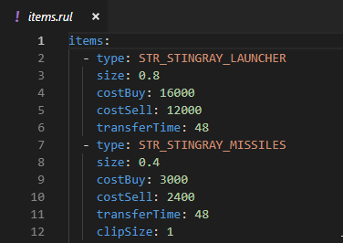

# Ruleset Tools for Visual Studio Code (FrA edition)

This extension adds support for OpenXcom [rulesets](https://www.ufopaedia.org/index.php/Rulesets_(OpenXcom)) to Visual Studio Code for a better editing experience. Powered by [vscode-yaml](https://github.com/redhat-developer/vscode-yaml). This particular version can be used with mods for [X-COM: From the Ashes engine](https://github.com/723Studio/OpenXcom_FTA) to validate it's additional ruleset syntax.

## Features

* Registers `*.rul` as YAML files, enabling syntax highlighting and validation.
* Validates the names and datatypes of all ruleset properties via [JSON schemas](https://json-schema.org/).
* Supports autocompletion.
* Supports OpenXcom Extended and FtA.

## Future Ideas

* Validate logic errors in ruleset properties.
* Autocompletion and validation of complex datatypes (eg. string IDs).
* Common ruleset snippets.
* Outline by element IDs.
* Support for other filetypes.
